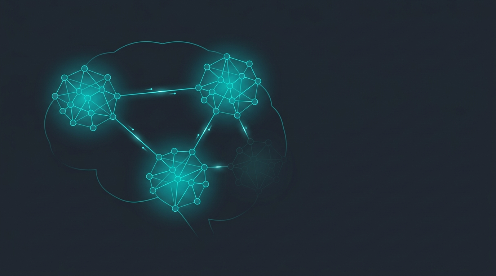
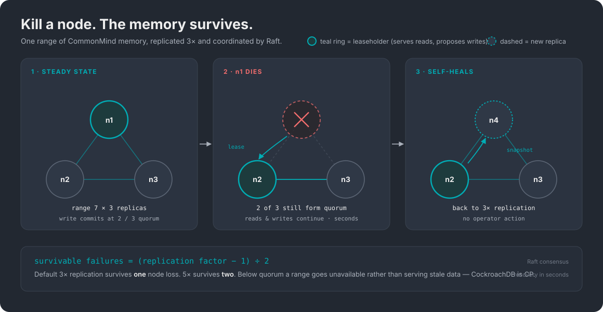
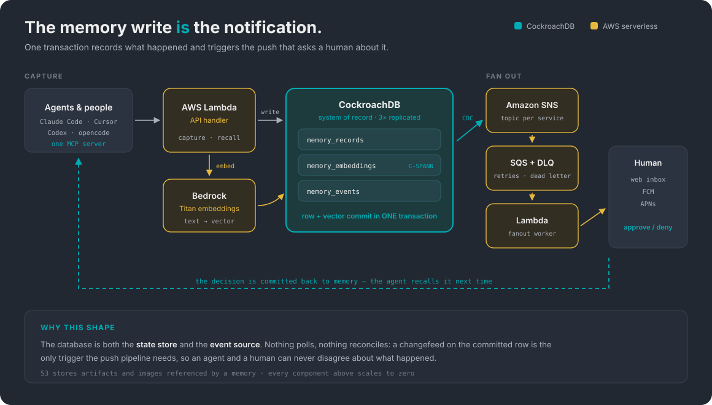

# 🧠 CommonMind — Shared Memory for Humans and Agents

<div align="center">



### Universal memory for human and agent teamwork

**Agents forget everything when the session ends. The people who needed to know never find out what they did.**

CommonMind is the one memory they share — transactional, distributed, and engineered not to go down.

</div>

[](./LICENSE)
[](https://www.cockroachlabs.com/)
[](https://www.cockroachlabs.com/blog/cspann-real-time-indexing-billions-vectors/)
[](https://aws.amazon.com/free/)
[](https://www.typescriptlang.org/)
[](./docs/BUILD_LOG.md)

**New here? → [Start here](./CONTRIBUTING.md)** · [Live site](https://commonmind.agent9.dev) · [Build log](./docs/BUILD_LOG.md) · [Developer spec](./docs/DEVELOPER_SPEC.md) · [Architecture](#architecture) · [Failure modes](#consistency-and-failure-modes)

---

## Table of contents

- [The problem](#the-problem)
- [What CommonMind is](#what-commonmind-is)
- [Why CockroachDB](#why-cockroachdb)
- [Why AWS serverless](#why-aws-serverless)
- [Architecture](#architecture)
- [Data model](#data-model)
- [The three agents](#the-three-agents)
- [The human interface](#the-human-interface-a-doorbell-not-a-pager)
- [Public and private memory](#public-and-private-memory)
- [Consistency and failure modes](#consistency-and-failure-modes)
- [Security model](#security-model)
- [Observability](#observability)
- [Quickstart](#quickstart)
- [Interface surface](#interface-surface)
- [The ten principles](#the-ten-principles)
- [Proof surfaces](#proof-surfaces)
- [Editions](#editions)
- [Hackathon compliance](#hackathon-compliance)
- [Roadmap](#roadmap)
- [Repo layout](#repo-layout)
- [Status and honesty policy](#status-and-honesty-policy)

---

## The problem

Two failures, and they compound.

**Agents forget.** Context dies with the session. An agent that spent forty minutes learning your codebase's auth quirks starts tomorrow knowing nothing. The industry's answer has been to stuff more into the context window, which is expensive, lossy, and still gone at the end of the turn.

**Humans and agents don't share a memory.** Agents emit a flood of events; people can't absorb a flood, so the person who needed to know doesn't. When an agent finally does need a human — "should I deploy this?" — it has no channel that carries enough context for the human to answer well, and no way to remember the answer next time.

Most memory products solve the first problem. CommonMind treats them as the same problem: **if the memory is genuinely shared, the human's decision is just another memory the agent recalls.**

### Concrete failure modes we're targeting

| Situation | Without shared memory | With CommonMind |
|---|---|---|
| Agent resumes after a crash | Restarts from zero, redoes work | Recalls its own last-known state and continues |
| New engineer asks "how does auth work?" | Interrupts whoever knows | Queries the brain; gets the decision *and* its rationale |
| Agent hits a risky action | Acts anyway, or blocks forever | Asks a human; the answer is stored and reused |
| Two agents work the same problem | Duplicate or conflicting work | Coordinate by reading/writing one transactional log |
| A node dies mid-write | Partial state, torn memory | Row and embedding commit atomically or not at all |

---

## What CommonMind is

A memory layer where **CockroachDB is the system of record**, not a cache in front of one.

```
capture  →  recall  →  act (with human approval)  →  improve
```

1. **Capture** — an agent or person records what happened. The row *and* its embedding commit in one transaction.
2. **Recall** — semantic search over everything captured, via CockroachDB's C-SPANN vector index.
3. **Act** — the agent does safe work autonomously and stops for a human on consequential decisions.
4. **Improve** — background consolidation scores novelty, extracts patterns, and reorganises memory so recall gets better over time.

**What it is not:** a RAG wrapper, a vector store bolted onto a chat app, or a notification service. The distinguishing claim is that *the transactional memory log is also the coordination bus and the event source*. Nothing polls. Nothing reconciles.

---

## Why CockroachDB

Because an agent whose memory goes offline doesn't degrade gracefully. **It stops.**

CockroachDB was built by people who hit this at Google first. **Spencer Kimball** and **Peter Mattis** worked on the **Google File System** team — Mattis later on **Colossus**, its successor — and **Ben Darnell** on Google Reader. They watched Google solve globally-distributed relational data with **Spanner**, hit the same wall again at their own startup, and in 2015 built the open-source answer. They named it after the animal that survives anything.

<div align="center">



*One range of CommonMind memory, replicated 3× and coordinated by Raft. Lose the leaseholder and the cluster re-elects, transfers the lease, and re-replicates — in seconds, with no operator action.*

</div>

### The guarantee, stated precisely

"Never goes down" is marketing. This is the engineering:

| Property | Guarantee |
|---|---|
| Replication | Every range replicated **3× by default** across distinct nodes |
| Consensus | **Raft** — a write commits once a **majority** of replicas acknowledge |
| Survivable failures | **(replication factor − 1) ÷ 2** → 3× survives **one** node; 5× survives **two** |
| Recovery | Detect → Raft re-election → lease transfer → re-replication, **in seconds** |
| Under partition | **CP** — below quorum a range goes *unavailable* rather than serving stale data |
| Isolation | **Serializable** by default |

The last two rows are why this database and not another. A memory layer that returns *stale* context is more dangerous than one that returns an error, because the agent will act on it with full confidence. We would rather an agent be told "memory is unavailable" than be told something that was true ten minutes ago.

> **This constrains our own demo.** On a 3-node cluster we can kill exactly **one** node on camera. Killing two is not a CockroachDB failure, it's the documented quorum boundary. The kill-the-node video uses a 3-node cluster and kills one, or a 5-node cluster and kills two — stated explicitly either way.

### Vector search in the same transaction

CockroachDB indexes vectors with **C-SPANN**: a hierarchical K-means partition tree derived from Microsoft's **SPANN**, with **SPFresh**-style incremental updates and quantization ideas from Google's **ScaNN**.

**It is not HNSW, and that matters for this workload.** HNSW is an in-memory navigable graph — excellent at moderate scale, but the graph doesn't shard cleanly across nodes and degrades under sustained inserts and deletes until it's rebuilt. An agent memory is *nothing but* sustained writes. C-SPANN partitions shard onto CockroachDB ranges like any other data, and new vectors are searchable immediately with no rebuild.

> ⚠️ **Contributors:** pgvector syntax (`USING hnsw (...)`) will not run on CockroachDB. Use `CREATE VECTOR INDEX`.

### CockroachDB is not Postgres — read this before you assume anything

This distinction has already cost us one bug, so it's worth being precise.

**CockroachDB is not built on, forked from, or code-derived from PostgreSQL.** It's an independently developed distributed database, written in Go and modelled on Spanner. What it does is implement **the PostgreSQL wire protocol (pgwire v3.0)** and the majority of Postgres *syntax*, deliberately, so existing tooling works.

| | |
|---|---|
| **Why we depend on `pg`** | The node-postgres driver speaks pgwire, so it talks to CockroachDB unmodified |
| **Why the DSN says `postgresql://`** | Same reason — it's the wire protocol's scheme, on CockroachDB's port **26257**, not Postgres' 5432 |
| **Where compatibility stops** | Anything hard to implement in a distributed system: `CREATE DOMAIN`, range types, XML functions, advisory locks — **and pgvector** |

**The practical rule:** treat Postgres knowledge as a useful prior, never as an authority. When a Postgres answer and a CockroachDB doc disagree, the CockroachDB doc wins. Our `USING hnsw` bug came from exactly this — Postgres-with-pgvector indexes vectors that way, CockroachDB does not implement HNSW at all, and "it's Postgres compatible" made the wrong answer look right.

```sql
CREATE VECTOR INDEX memory_embeddings_cspann
  ON memory_embeddings (embedding vector_cosine_ops);
```

---

## Why AWS serverless

Every component scales to zero, so an idle memory layer costs nothing and a busy one costs per invocation. The [AWS Free Tier](https://aws.amazon.com/free/) covers the entire development path.

<div align="center">



*The database is both the state store and the event source — a changefeed on the committed row is the only trigger the push pipeline needs.*

</div>

### The organising principle

**The database is the event source.** That single decision deletes an entire category of infrastructure. There's no message broker to operate, no outbox table, no reconciliation job, and no dual-write bug — because nothing publishes an event separately from committing the row. **The commit is the event.**

Everything else follows from it.

| Layer | Choice | What it replaces, and why ours wins |
|---|---|---|
| **Memory** | **CockroachDB Cloud Basic** (serverless, on AWS) | vs. a dedicated Standard cluster at ~$120–130/mo — which alone would exceed the entire $20/employee price point. Basic is RU-metered and scales to zero |
| **Compute** | **AWS Lambda** | vs. ECS/EKS — containers you size, patch, and pay for while idle. Lambda is 1M requests/month free, permanently |
| **HTTP front** | **Lambda Function URLs** | vs. API Gateway — a separate service with routes, stages and integrations to configure. We need an HTTPS endpoint, not a gateway |
| **Embeddings** | **Bedrock**, Titan v2 @ 1024 | vs. a SageMaker endpoint, which bills while idle — the opposite of serverless. vs. OpenAI, which isn't AWS and fails the requirement outright |
| **Fanout** | **SNS** → **SQS + DLQ** | vs. Lambda subscribed directly to SNS, which has no retry buffer and no dead-letter — one failed push becomes a permanently lost notification |
| **Artifacts** | **S3** | Standard, boring, correct |

**Explicitly not used: DynamoDB.** It's a second database, and the thesis here is that *CockroachDB is the system of record for agentic memory*. A second store means a second source of truth, and something has to reconcile them. It fills no gap.

### Why this shape, and not just a cheap one

**Nothing costs anything at rest.** Every layer scales to zero, so an idle tenant is ~free and a busy one bills per invocation. That's what makes $20/employee/month work at 80–90% gross margin. The [AWS Free Tier](https://aws.amazon.com/free/) covers Lambda (1M requests/mo, always free), SNS (1M publishes), SQS (1M requests) and S3 (5 GB). Bedrock isn't free-tier, but Titan v2 at **$0.02 per million input tokens** makes embedding effectively free at demo scale.

**There is exactly one source of truth.** Memory durability never depends on the delivery path. A push can fail, retry, or be dropped entirely and the memory is still correct — it was committed before anything downstream knew it existed.

**Every hop fails safely.** Bedrock down → capture fails closed, no row without its embedding. Lambda down → SQS retries, then dead-letters. Changefeed lagging → the push is late, not lost. The only component whose failure would cost data is CockroachDB, which is the one component engineered specifically not to.

**Why not a queue-first design?** Because the changefeed *is* the queue, and it's transactional. Publishing to a queue from application code reintroduces the dual-write problem: a row committed but its event lost, or an event emitted for a transaction that rolled back. CDC off the committed row makes that class of bug unrepresentable.

**And the one weak spot, stated plainly.** Lambda cold starts run 100 ms–1 s+. The `<50ms` recall figure is a **database-side** measurement, not end-to-end through a cold function. That gets measured properly and republished, or the claim comes off — tracked in [`CHECKLIST.md`](./docs/CHECKLIST.md).

---

## Architecture

### The atomic-write invariant

This is the core guarantee, and every design decision defers to it:

> **A memory record and its embedding commit in the same transaction.**

```sql
BEGIN;
  INSERT INTO memory_records (entity_type, content)
    VALUES ($1, $2) RETURNING id;
  INSERT INTO memory_embeddings (entity_type, entity_id, embedding)
    VALUES ($1, $id, $3::vector);
COMMIT;
```

There is no window in which something happened but isn't yet retrievable. Consolidation workers and the CDC pipeline read only from these transactional tables, so no consumer can observe a half-written memory. Any PR that splits these writes is wrong regardless of how much faster it is.

### Request paths

**Capture:** agent → Lambda API → Bedrock (embed) → CockroachDB (one txn) → changefeed → SNS → SQS → Lambda fanout → push target

**Recall:** agent → Lambda API → Bedrock (embed query) → C-SPANN nearest-neighbour search → joined rows → agent

**Approve:** agent requests → notification row committed → push → human decides → decision committed as a new memory → agent resumes with it in context

For the agent-role view of the same system — Memory Agent, Operator Agent and Dream-Weaver against the CockroachDB tables and AWS services — see [`assets/architecture.svg`](./assets/architecture.svg). Both diagrams agree on the write path: `memory_records` is the captured row, matching `src/memory/repository.ts`.

---

## Data model

Full DDL in [`src/db/schema.sql`](./src/db/schema.sql). The memory core:

| Table | Purpose | Notes |
|---|---|---|
| `memory_records` | What happened | The durable content |
| `memory_embeddings` | Its vector | `VECTOR(n)`, C-SPANN indexed, `entity_id` indexed for the recall join |
| `memory_consolidations` | Dream-weaver output | Patterns, digests, surprise scores |
| `memory_events` | Changefeed source | PK is `unique_rowid()`, **never** `SERIAL` |
| `notifications` | Agent → human milestones | Idempotency-keyed, with response state machine |
| `live_activities` | Stateful cards | Optimistic concurrency via `sequence` |
| `services` / `devices` | Tenancy and push targets | |

**Two schema decisions worth calling out:**

*Sequential primary keys are banned.* `memory_events` uses `unique_rowid()`, not `BIGSERIAL`. A monotonic PK funnels every insert into a single range and creates a write hotspot — the classic CockroachDB anti-pattern, and `memory_events` is our hottest write path. This is the difference between a system that scales horizontally and one that only claims to.

*Vector dimension is `VECTOR(1024)` — Titan v2's native default, decided Aug 4.* The schema originally said 768 — a dimension no Bedrock model emits, so it had to move.

We chose **Amazon Titan Text Embeddings V2 at 1024** over the alternatives:

| Option | Dims | Verdict |
|---|---|---|
| **Titan v2 (default)** | **1024** | ✅ Retrieval-optimised second generation; **$0.02 / M input tokens** |
| Titan v2 (reduced) | 512 / 256 | Matryoshka truncations retaining ~99% / ~97% recall — a real optimisation, but *after* submission |
| Titan v1 | 1536 | ❌ **5× the token price** of v2, ~33% larger index, not retrieval-optimised |

At 4 KB per vector, storage isn't a constraint at our scale, and the Dream-Weaver's "measurably better over time" claim needs a clean quality baseline rather than a truncation chosen for storage we don't need.

---

## The three agents

| Agent | Responsibility | Constraint |
|---|---|---|
| **Memory Agent** | Capture and recall | Never writes a row without its embedding |
| **Operator Agent** | Acts on memory | Autonomous on safe work; stops for a human on consequential decisions |
| **Dream-Weaver** | Consolidation | Runs in the background; reads only committed rows; never mutates source memories |

Agents coordinate by **reading and writing shared memory**, not by messaging each other. The transactional log is the coordination bus, which means coordination is auditable by construction.

---

## The human interface: a doorbell, not a pager

Agents emit a flood. People can't absorb a flood. So every event is recorded, and only three classes ever reach a human:

| Regime | Trigger | Behaviour |
|---|---|---|
| **Silent** | Safe step — build, retry, query, happy-path sub-task | Recorded, never pushed |
| **Alert** | A milestone crossed, or "needs your decision" | A push you can act on |
| **Priority** | Finished differently — failure, delay, an answer you'd want tonight | Wakes you if needed |

**A push is a doorbell, not a notice.** The interaction is two-way:

```
doorbell → thread: ask back → decide (approve / edit / deny) → agent resumes → exchange becomes memory
```

Response kinds: `approval`, `yes_no`, `text_reply`, `thread_question`. The thread persists in the same memory layer as everything else — recallable and auditable. **The exchange itself becomes memory**, so the next decision of that shape is faster and, eventually, unnecessary.

---

## Public and private memory

Every person and every agent contributes to one shared datastore, but contribution is not surveillance.

| | Visibility | Indexed |
|---|---|---|
| **Public** | Teammates and agents; searchable by everyone | Yes — grows the company index |
| **Private** | The contributor only | **Never** added to the company index |

> Contribute freely. The brain grows from everyone, and everyone controls their footprint.

This is a hard boundary in the data model, not a UI filter: private rows are excluded from the shared index at write time, so a recall query cannot surface them regardless of who asks.

---

## Consistency and failure modes

What actually happens when each component fails:

| Failure | Behaviour | Data loss |
|---|---|---|
| One node dies (RF=3) | Raft re-elects, lease transfers, re-replication starts; reads and writes continue | None |
| Majority lost | Range unavailable; writes rejected | None — refuses rather than diverging |
| Bedrock unavailable | Capture fails closed; no row without its embedding | None — the transaction rolls back |
| Lambda fanout fails | SQS retries, then DLQ; memory already committed | None — push is retryable, memory is durable |
| Changefeed lags | Push is late; recall unaffected | None |
| Human never answers | Approval expires at `expires_at`; agent takes the safe path | None |
| Two agents write the same key | Serializable isolation; one retries | None |

**The invariant across every row:** memory durability never depends on the delivery path. A push can fail, be retried, or be dropped entirely and the memory is still correct.

---

## Security model

| Concern | Approach |
|---|---|
| Tenancy | `owner_id` scoping per row; org namespaces |
| Auth | Webhook token per service, or bearer token |
| Secrets | Environment only; `.env` git-ignored; no credentials in source |
| Private memory | Per-contributor private rows are never added to the shared index |
| Audit | Every write is an event row — who, what, when, which agent |
| Least privilege | MCP server exposes read-only introspection by default |
| Transport | TLS to the cluster; `sslmode` enforced outside dev |

---

## Observability

Because "did the agent actually remember?" has to be answerable.

- **Capture rate** — writes/sec by agent and by entity type
- **Recall quality** — similarity score distribution; queries returning nothing
- **Approval latency** — request → human decision, the one humans feel
- **Changefeed lag** — commit → push delivered
- **Brain health** — which people and agents are actively contributing, so nothing important goes quiet
- **Consolidation gain** — recall quality before vs after dream-weaver runs; the "memory improves itself" claim has to be measurable or it gets cut

---

## Quickstart

**Prerequisites:** Node 20+, CockroachDB v25.2+ (vector indexes), optional AWS credentials for Bedrock.

```bash
git clone https://github.com/LandCruiserWorld/commonmind.git
cd commonmind
npm install

cp .env.example .env          # set COCKROACH_DB_URL

cockroach start-single-node --insecure --listen-addr=localhost:26257 &
cockroach sql --insecure -e "CREATE DATABASE commonmind;"
cockroach sql --insecure --database commonmind < src/db/schema.sql

npm run check                 # type-check
npm test
```

---

## Interface surface

The front door is one command; the target shape:

```bash
npm install -g commonmind
commonmind connect claude          # register the MCP server / capture hooks
commonmind save "chose Raft over Paxos — simpler membership changes"
commonmind ask "why did we pick Raft?"
commonmind ask --approval "deploy 8e7fc2a to production?"
```

One **MCP server** covers every agent CLI — Claude Code, Cursor, Codex, opencode — exposing `memory.capture`, `memory.recall`, `memory.ask`, `memory.approve`, `memory.note`. No per-app plugins.

---

## The ten principles

Carried on the landing page as machine-readable JSON-LD (`#commonmind-bible`) so agents building here can read them.

| | |
|---|---|
| **1** Memory is the product | **6** One core, any product |
| **2** Memory must never go down | **7** Brain health, not timecard |
| **3** Bridge, don't flood | **8** The front door matters |
| **4** Milestones, not noise | **9** Memory improves itself |
| **5** Human decides, agent executes | **10** Kill the node, memory survives |

---

## Hackathon compliance

Built for the [CockroachDB × AWS Hackathon — Build with Agentic Memory](https://cockroachdb-ai.devpost.com/). Rules require **two** CockroachDB tools and **one** AWS service.

| CockroachDB tool | How we use it |
|---|---|
| **Distributed Vector Indexing** | C-SPANN over `memory_embeddings` for recall and surprise scoring |
| **Managed MCP Server** | One server so any agent CLI reads/writes memory — no per-app plugins |
| **ccloud CLI** | A memory-ops agent provisions clusters, takes backups, configures RBAC |
| **Agent Skills Repo** | `commonmind-query`, `commonmind-approve`, `commonmind-consolidate` |
| **Changefeeds (CDC)** | *Beyond the required list* — the transactional event stream driving push |

We exceed the **2-of-4** requirement: **all four** required CockroachDB tools are used, plus changefeeds beyond the list.

### AWS services (requirement: at least one — we use four)

| AWS service | What the agent actually does with it |
|---|---|
| **Amazon Bedrock** | Titan Text Embeddings V2 (1024-dim) embeds every capture and query; recall/summarization LLM answers from the memory layer |
| **AWS Lambda** | Serverless agent execution behind Lambda Function URLs — capture, recall, and approval handlers scale to zero |
| **Amazon SNS → SQS + DLQ** | Changefeed fanout for the push pipeline, with retry and dead-lettering so no notification is lost |
| **Amazon S3** | Artifact/document storage — exported memory snapshots and runbook sources |

Full rationale in [Why AWS serverless](#why-aws-serverless).

### Submission requirements checklist (what the judges will verify)

| Devpost requirement | Status | Proof location |
|---|---|---|
| Public open-source repo | ✅ | `github.com/LandCruiserWorld/commonmind` (public, Apache-2.0, license visible in About) |
| All necessary source code | ✅ | `src/` |
| Clear README documentation | ✅ | this file |
| Dependencies declared | ✅ | `package.json`, `package-lock.json` |
| Example configuration | ✅ | `.env.example` |
| Setup + run instructions | ✅ | [Quickstart](#quickstart) |
| Functional demo app URL | ✅ | `https://commonmind.agent9.dev` |
| Video < 3 min, CockroachDB memory layer at work | 🟡 | recording — [BUILD_LOG](docs/BUILD_LOG.md) |
| **2×** CockroachDB tools (we use **4 + changefeeds**) | ✅ | table above |
| **1×** AWS service (we use **4**) | ✅ | table above |
| Architectural diagram | ✅ | `assets/images/aws-serverless-architecture.svg` + [Architecture](#architecture) |

---

## Proof surfaces

One memory core, four unrelated products. The point of building four is that a memory layer which only works for one workload isn't a memory layer, it's a feature.

| Surface | Integration | What it proves |
|---|---|---|
| **Solana trading platform** | Trade decisions captured; risky entries ping the owner's phone for approval. Runs on a Raspberry Pi over Tailscale | Kill the node — the bot keeps its context |
| **Dev-team coding sessions** | Capture hooks on Claude Code, Antigravity, opencode, Kimi K3, Qwen | A new hire asks the brain, not the person who knows |
| **Marketing agency** | Client preferences, brand guidelines, campaign history to a shared per-client brain | Onboarding takes days, not months; brand voice never drifts |
| **Ocean Dreams** (game) | The creature remembers player behaviour across sessions | Behaviour visibly changes based on what it remembers about you |

---

## Editions

| | Self-hosted | Premium | Enterprise |
|---|---|---|---|
| **Price** | **$0 forever** | ~~$20/employee/mo~~ **Free** · limited-time launch | Custom |
| Memory core — capture, recall, act, consolidate | ✅ | ✅ | ✅ |
| Integrations, MCP server, web inbox | ✅ | ✅ | ✅ |
| Runs on | Your own CockroachDB | Managed serverless AWS | On-prem / VPC |
| Uptime | Yours | 99% monitored | Custom SLA |
| Support | Community | Self-serve onboarding | Dedicated engineer, 24/7 |

Open source is free forever and always will be — self-host it, embed it in a product, ship it. Premium is for teams who'd rather not run a database — free during launch, no card required: cutting-edge memory on resilient AWS + CockroachDB infrastructure, on us.

---

## Roadmap

Deadline **Aug 18, 2026, 5:00 PM EDT**. Dates from the build log:

| Date | Deliverable |
|---|---|
| **Aug 6** | `create-commonmind` scaffold + CLI |
| **Aug 9** | Capture → recall end-to-end against a live cluster |
| **Aug 12** | Trading bot on Raspberry Pi + Tailscale |
| **Aug 14** | Ocean Dreams integration |
| **Aug 16** | Agents layer + resilience |
| **Aug 17** | Demo video + kill-the-node |
| **Aug 18** | Submission |

Live status and open decisions: [`docs/BUILD_LOG.md`](./docs/BUILD_LOG.md).

---

## Repo layout

```
src/
  config.ts            env + defaults
  db.ts                pool + transaction helper
  memory/
    repository.ts      atomic write + recall
    types.ts           domain types
  db/schema.sql        CockroachDB DDL
docs/
  BUILD_LOG.md         live status, decisions, open questions
  DEVELOPER_SPEC.md    schema, API contract, components
  MASTER_DEVELOPER_DOC.md
  STRATEGIC_PLAN.md
  agents/AGENTS.md     rules for coding agents in this repo
  site/index.html      landing page + JSON-LD bible (single copy)
assets/images/         cover, architecture and resilience diagrams
tests/
```

---

## Status and honesty policy

This repo is **under active build**. What's true today:

| | |
|---|---|
| ✅ Done | Schema, TypeScript memory core, product bible + JSON-LD, landing page, architecture, MCP server (capture · recall · ask · approve · note), approval round-trip, CDC → SNS → SQS pipeline, capture → recall against a live cluster (CLI + HTTP) |
| 🟡 In build | `npm install -g commonmind` front door, trading-bot integration (live on the platform, not yet demo-recorded), kill-the-node capture |
| ⏳ Next | Multi-node benchmark numbers, demo video |
| ⬜ Later | Dream-weaver consolidation ([spec](docs/DREAM_WEAVER_SPEC.md)), Ocean Dreams integration |

**Performance figures on the landing page are design targets, not measurements.** They will be replaced with benchmarked numbers and the method to reproduce them before submission, or removed. We would rather show one measured number than five aspirational ones — a claim we can't reproduce on demand is a claim a judge can dismantle.

---

## License

[Apache-2.0](./LICENSE)
